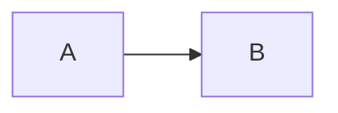

[toc]

# Markdown 语法简介

## 二级标题

### 三级标题

#### 四级标题

##### 五级标题

###### 六级标题

## 文本

**粗体** <br>
_斜体_ <br>
==标记== <br>
++下划线++ <br>
~~中划线~~ <br>
上^角标^ <br>
下~角标~ <br>

## 引用

> 一级
>
> > 二级
> >
> > > 三级
> > > ...

## 列表

有序列表

1. a
2. b
3. c

无序列表

- a
- b
- c

## 任务

- [x] 已完成任务
- [ ] 未完成任务

## 链接

[链接](www.baidu.com)


## 表格(table)

| 标题 1                 |    标题 2     |            标题 3 |
| :--------------------- | :-----------: | ----------------: |
| 左对齐                 |     居中      |            右对齐 |
| ---------------------- | ------------- | ----------------- |

## 脚注(footnote)

见底部脚注[^hello]

[^hello]: 一个注脚

## 代码

`行内`代码

```js
function foo() {
  const str = "块级代码";
  return str;
}
```

## 提示

::: info
信息
:::

::: note
注意
:::

## mermaid


